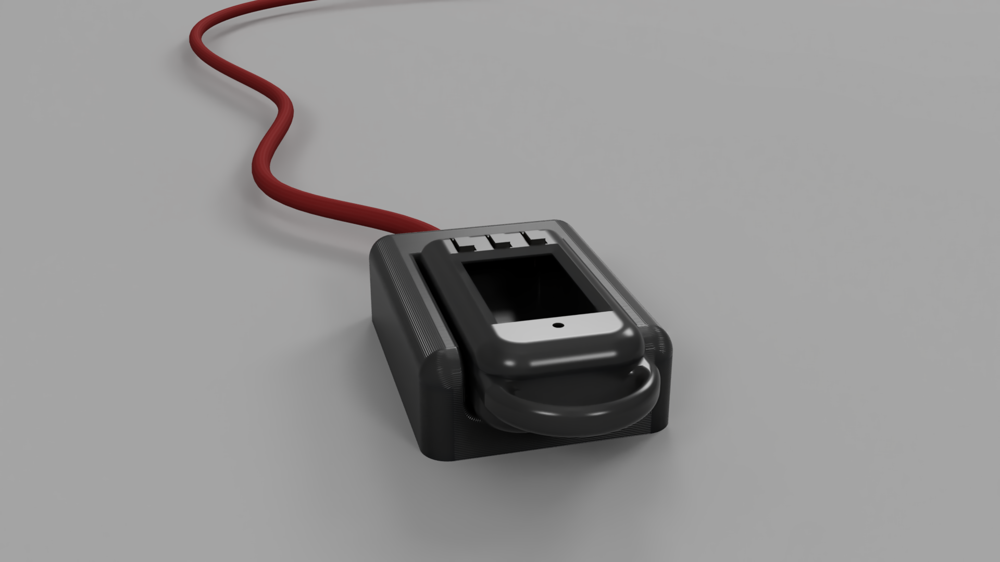

# ESP32 Remote Display – Worksheet


**Module/Project:** ESP32 Remote Display with Sub‑GHz Radio & Low‑Power UX
**Author:** Jack Holdsworth

- [ESP32 Remote Display – Worksheet](#esp32-remote-display--worksheet)
  - [Description](#description)
    - [Device Gallery](#device-gallery)
    - [Part 1: Display primitives (Graph \& Battery)](#part-1-display-primitives-graph--battery)
    - [Part 2: Data structures (LIFO graph buffer) (LIFO graph buffer)](#part-2-data-structures-lifo-graph-buffer-lifo-graph-buffer)
    - [Part 3: Screen Manager](#part-3-screen-manager)
    - [Part 4: Radio \& Packets (SPIRIT1)](#part-4-radio--packets-spirit1)
    - [Part 5: Power \& Sleep (RTC wake)](#part-5-power--sleep-rtc-wake)
    - [Part 6: Config \& Persistence (EEPROM) (EEPROM)](#part-6-config--persistence-eeprom-eeprom)
  - [Getting Started](#getting-started)
    - [Hardware](#hardware)
    - [Software](#software)
  - [Repository Layout](#repository-layout)
  - [Build \& Flash](#build--flash)
  - [Usage](#usage)
  - [Troubleshooting](#troubleshooting)
  - [Authors](#authors)
  - [Version History](#version-history)
  - [License](#license)

## Description

### Device Gallery

* UWE Logo:
  
* Keychain prototype with display:
  


This project implements a low‑power **remote display** on an **ESP32** with:

* A **ST7789** 240×135 TFT UI (graphs, battery icon, screen switching).
* A **Sub‑GHz SPIRIT1** radio receiver/transmitter for broadcast packets.
* **EEPROM‑backed** configuration with boot‑time recovery.
* **RTC sleep/wake** scheduling to align with broadcast cadence while preserving UX.

The project is architected as a few tight components:

* `remote.ino` – orchestration, button input, wake/sleep policy, screen manager.
* `src/graph` – lightweight, in‑RAM graph rendering primitives for ST7789 using `GFXcanvas16`.
* `src/battery` – composable battery widget rendering with thresholds and text overlay.
* `src/lifo_queue` – tiny LIFO (stack) list to hold recent samples for graph drawing.
* `src/spsgrf` – SPIRIT1 radio driver and packet handler (RX/TX, VCO calibration, base config).
* `src/screens` – modular screen controller; renders battery and graph screens.

> **Design goal:** quick boot, quick glance. The device wakes, optionally receives a packet, renders concise information (graph + battery), and returns to sleep on an RTC timer aligned to the broadcast period.

### Part 1: Display primitives (Graph & Battery)

The display layer uses **`GFXcanvas16`** so that each widget renders to an off‑screen buffer first and then blits to the TFT. The **Graph** draws vertical bars or line segments based on recent values. The **Battery** widget draws outline, tip, and a level fill with color thresholds.


**Why this approach**

* **Off‑screen canvas (`GFXcanvas16`)** keeps drawing deterministic and prevents visible tearing on SPI TFTs. 16‑bit color (RGB565) is a good balance between memory and fidelity for a 240×135 panel (≈64.8 KB if full‑frame; widgets render to sub‑regions to keep RAM use low).
* **Integer math** and simple primitives (lines/rects) keep frame time < \~10 ms on 80–160 MHz SPI, even without DMA.
* **Widget composition** (graph + battery) gives layout flexibility and clear separation of concerns.

### Part 2: Data structures (LIFO graph buffer) (LIFO graph buffer)

**Choices made:**

* Implemented as a **stack‑like queue** rather than a ring buffer. This was chosen for simplicity: most recent values are what matter for graphing, and older values can be dropped.
* Includes a **deep copy operator** so rendering can snapshot the queue without disturbing live data. This helps separate data acquisition (radio/packets) from UI rendering.
* Fixed capacity avoids heap fragmentation and keeps RAM predictable, which is critical in embedded systems.

### Part 3: Screen Manager

The **screen manager** abstracts different TFT layouts (e.g., graph view, battery view). Each screen derives from a base `Screen` class and implements `render(Adafruit_ST7789*)`. Navigation between screens is handled by button interrupts.


* `graph_screen` – renders a history graph using `Graph` + LIFO data.
* `battery_screen` – displays battery widget with percentage.
* `screens` – manages current screen, switching, and redraw requests.

**Why this approach**

* A tiny **polymorphic interface** lets you add screens without touching the app core. It also enables headless testing (mock display).
* **Explicit render()** keeps state minimal; screens compute their own layout and do not own hardware, avoiding tight coupling.

### Part 4: Radio & Packets (SPIRIT1)

The SPIRIT1 integration (`spsgrf.cpp/hpp`, `packet_handler.hpp`) handles **low‑level radio control** via SPI:

* **Setup & init:** GPIO + SPI config, reset sequencing, base register configuration.
* **RX path:** flush FIFO, lock RX, wait for `MC_STATE=RX`, read FIFO until empty.
* **TX path:** write FIFO, lock TX, wait for `MC_STATE=TX`, then back to READY.
* **Calibration:** built‑in VCO calibration routine for stable RF operation.
* **Helpers:** read/write registers, send strobe commands, last RSSI readback.


**Why this approach**

* Direct register access keeps the driver **deterministic and inspectable**. It matches the vendor DK flow, making bring‑up predictable.
* **Conservative SPI speed** (125 kHz in early bring‑up) favors signal integrity on long jumpers; can be increased once stable.

### Part 5: Power & Sleep (RTC wake)

After **`SCREEN_WAKE_TIME`** seconds of inactivity, the device schedules deep sleep so that the next wake aligns **before** the next broadcast. Wake source is **timer**; boot path differentiates timer‑wake from button/first boot to decide whether to fetch a packet immediately or just render.



**Why this approach**

* Aligning wake with broadcasts maximizes the chance of catching a packet while minimizing idle listening time → **battery life**.
* Keeping a **short on‑time** (render → sleep) fits the “quick glance” UX.

### Part 6: Config & Persistence (EEPROM) (EEPROM)

Configuration (broadcast periods, radio/channel, UI choices) is persisted in **EEPROM**. On first boot (or when a new config packet is received) the values are saved and used for subsequent sleep scheduling.

**Why this approach**

* EEPROM (or flash‑emulated) gives a small, simple **key data store** without a filesystem.

**Trade‑offs & alternatives**

* EEPROM/flash has **limited write endurance**. Batch updates, write only on change, and consider a **wear‑leveled record** layout for hot fields.
* A tiny **TLV schema** with a version byte allows forward‑compatible upgrades.

**Gotchas**

* Always **commit** after writes; power loss during update can corrupt fields. Use a **two‑phase write** (write new → set valid flag → clear old) and include a checksum.
* Reserve a **factory reset** path (e.g., long‑press on boot) that clears config back to defaults.

**Future work**

* Add **CRC + versioning** to the config blob and maintain a small **ring of records** for wear leveling and rollback.
  **Choices made:**
* EEPROM was used instead of SPIFFS/LittleFS because the config data is small and structured, making EEPROM more lightweight.
* Configuration is **self‑healing**: if the EEPROM is empty or corrupted, defaults are applied and saved.
* Storing broadcast/timing parameters in EEPROM allows the device to resume correct behavior after reset or power loss without waiting for a fresh packet.

---

## Getting Started

### Hardware

* **ESP32** dev board (C3/S3/ESP32 classic)
* **ST7789** 240×135 TFT (SPI)
* **Buttons** ×3 (GPIO with `INPUT_PULLUP`)
* **SPIRIT1** (SPSGRF) sub‑GHz module

### Software

* Arduino core for ESP32 (2.x+)
* Libraries: `Adafruit_ST7789`, `Adafruit_GFX`, `SPI`, `EEPROM`

```bash
# Recommended Arduino settings
Board: ESP32 Dev Module
Flash Size: 4MB (OTA or no OTA)
PSRAM: Disabled (unless you need it)
CPU Freq: 160–240 MHz
```

## Repository Layout

```
remote.ino                     # App entrypoint, sleep/wake, buttons, screen manager
src/
  graph/graph.hpp, graph.cpp   # Graph widget (bar/line), uses GFXcanvas16 and LIFO
  battery/battery.hpp          # Battery widget with thresholds and text
  lifo_queue/                  # Node + LifoQueue (deep copy, capacity‑bounded)
  spsgrf/                      # SPIRIT1 radio + PacketHandler (RX/TX, calibration)
  screens/                     # Screen base, GraphScreen, BatteryScreen, manager
assets/img/                    # README images (uwe.png, overall.svg, etc.)
```

## Build & Flash

1. Install Arduino core for ESP32 and required libs.
2. Open `remote.ino` in Arduino IDE or VS Code + Arduino extension.
3. Select your board/port and **Upload**.

For PlatformIO (optional):

```ini
[env:esp32dev]
platform = espressif32
board = esp32dev
framework = arduino
lib_deps = adafruit/Adafruit ST7735 and ST7789 Library, adafruit/Adafruit GFX Library
build_flags = -DCORE_DEBUG_LEVEL=3
```

## Usage

* **Buttons:** navigate screens / force refresh.
* **Auto‑sleep:** after `SCREEN_WAKE_TIME` seconds without interaction.
* **On timer wake:** device briefly listens for a broadcast; if present, updates graphs and commits config to EEPROM if changed.

## Troubleshooting

* **Blank display:** check SPI wiring and that `Adafruit_ST7789` init pins match your board.
* **No packets on wake:** verify SPIRIT1 wiring, antenna, and that the broadcaster is alive; increase `listenPeriod` for testing.
* **Unexpected reboots:** EEPROM init failing will trigger a restart; try reducing `EEPROM_SIZE` or erasing NVS.

## Authors

Jack Holdsworth — [holdsworth.dev](https://holdsworth.dev)

## Version History

* 0.3 — Added SPIRIT1 radio driver (RX/TX, calibration, packet handler), refined README
* 0.2 — Added screen manager (graph + battery), refined README structure
* 0.1 — Initial README and module overview (graphs, battery, LIFO, sleep policy)

## License

This project is licensed under the GPL License — see `LICENSE` for details.
